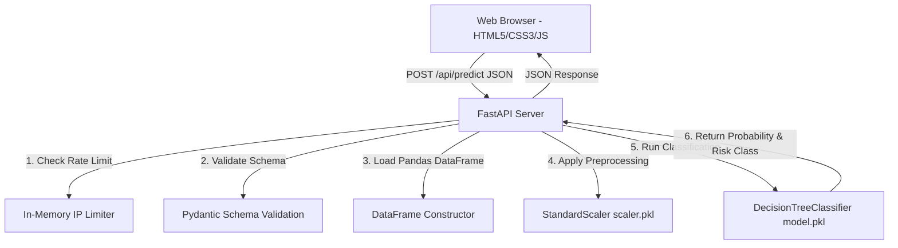

# CardioGuard AI - Frontend & System Documentation

This document explains the architecture, design choices, data flow, validation logic, and execution steps for the **CardioGuard AI** web application.

---

## 1. Directory Structure

The project files are laid out as follows:
```text
ML PROJECT/
├── Cardio_Cleaning_DecisionTree.ipynb   # Jupyter Notebook with data prep & model training
├── model.pkl                           # Trained Decision Tree Classifier (sklearn)
├── scaler.pkl                          # Trained Standard Scaler (sklearn)
├── app.py                              # FastAPI backend & web server
├── EXPLAINING.md                       # This documentation file
└── static/                             # Frontend assets served by app.py
    ├── index.html                      # HTML5 layout (Semantic, accessible tabs)
    ├── index.css                       # CSS3 styling (Glassmorphism, dark-mode, keyframes)
    └── index.js                        # JavaScript (Client-side validation, AJAX, dynamic report)
```

---

## 2. System Architecture

The application operates as a self-contained single-page application (SPA) with a lightweight, high-performance Python API backend:



---

## 3. Backend Implementation (`app.py`)

The backend is built using **FastAPI** to meet high-level engineering standards:
- **Zero Trust Schema Validation**: Pydantic models enforce exact clinical boundaries matching the model's clean dataset distribution:
  - Height: `100` to `220` cm.
  - Weight: `30` to `200` kg.
  - Systolic BP (`ap_hi`): `60` to `250` mmHg.
  - Diastolic BP (`ap_lo`): `40` to `200` mmHg.
  - Constraint: Systolic BP must be greater than or equal to Diastolic BP.
- **In-Memory IP Rate Limiter**: Implements a sliding-window rate limiter preventing API abuse by restricting individual client IPs to a maximum of 30 requests per minute.
- **Stateless Pipeline**: Features are packed into a pandas DataFrame in the exact sequence expected by `scaler.pkl`: `['gender', 'height', 'weight', 'ap_hi', 'ap_lo', 'cholesterol', 'gluc', 'smoke', 'alco', 'active', 'age_years']` before model classification.

---

## 4. Frontend Design Aesthetics (`static/index.css`)

The user interface is designed to deliver a premium, clinical diagnostic feel using vanilla CSS:
- **Visual Palette**: A deep tech theme with `#060713` background, contrasted against cyan and blue glowing accents representing oxygenated and deoxygenated blood pathways.
- **Glassmorphism**: Dashboard panels feature semi-transparent backgrounds with backdrop filters (`blur(12px)`) and subtle borders (`rgba(255, 255, 255, 0.05)`) mimicking clinical frosted glass.
- **Interactive Indicators**:
  - **Beating Heart**: A CSS pulse animation (`@keyframes heartBeat`) runs in the placeholder card, giving a responsive biological feel.
  - **Circular Gauge**: An SVG circle path (`stroke-dasharray` and `stroke-dashoffset`) dynamically animates the risk percentage using trigonometric circle circumference calculations (`2 * Math.PI * 90`).
  - **Custom Controls**: HTML range sliders and checkboxes are styled from scratch to replace default browser widgets with modern glowing toggles.

---

## 5. Client-Side JavaScript Logic (`static/index.js`)

The JavaScript layer coordinates interaction, validates parameters, communicates with the API, and generates dynamic recommendations:
- **Tab Swapping**: Toggles view panels between the **Health Analyzer** tool and **Model Insights** dashboard securely using ARIA role attributes.
- **Real-Time Warning Signals**: Displays immediate error messages if age, systolic, or diastolic metrics are entered outside ranges. If Systolic BP is typed lower than Diastolic BP, the submit button is locked.
- **Dynamic Medical Advisor**: After retrieving predictions, the client calculates BMI and reviews vitals to construct custom clinical advisories:
  - **BMI Advisory**: Computes BMI using `weight / (height / 100)^2`. Warns if the index is $\ge 25.0$.
  - **Hypertensive Advisory**: Warns if blood pressure is hypertensive ($\ge 140/90$ mmHg) or pre-hypertensive ($\ge 120/80$ mmHg).
  - **Lifestyle Advisories**: Provides critical warnings regarding smoking tobacco, high alcohol intake, and physical inactivity.

---

## 6. How to Deploy and Run

Follow these steps to launch the application locally:

### 1. Install Dependencies
Run in your python environment:
```bash
pip install fastapi uvicorn pandas joblib scikit-learn
```

### 2. Launch Server
Execute the backend app:
```bash
python app.py
```
This starts the development server at `http://127.0.0.1:8000`.

### 3. Access Dashboard
Open a browser and navigate to `http://127.0.0.1:8000` to interact with the CardioGuard AI application.
